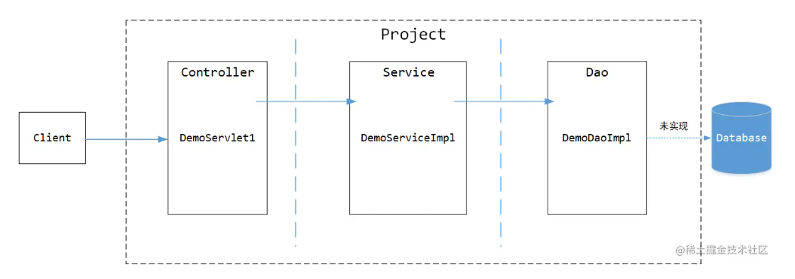
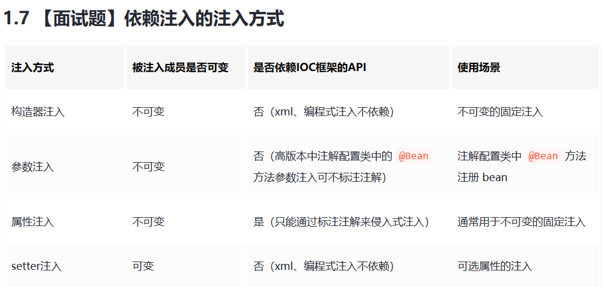
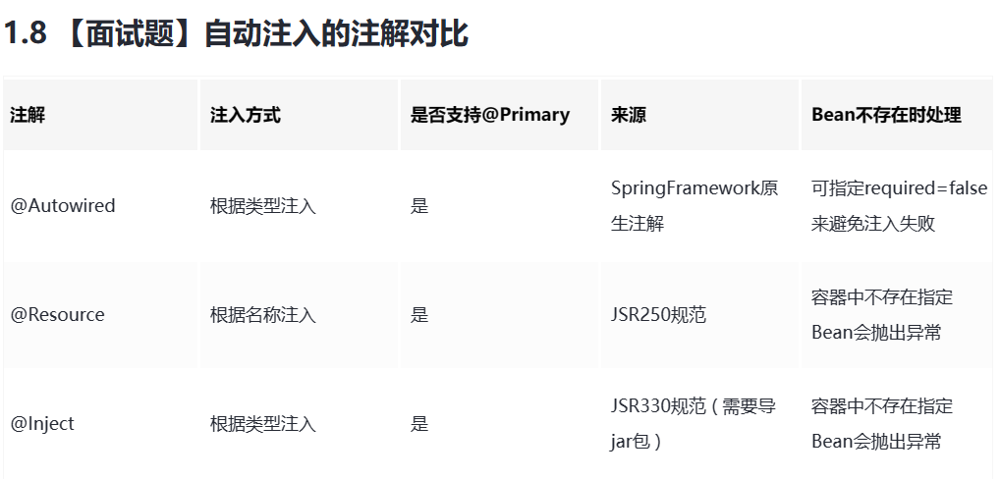
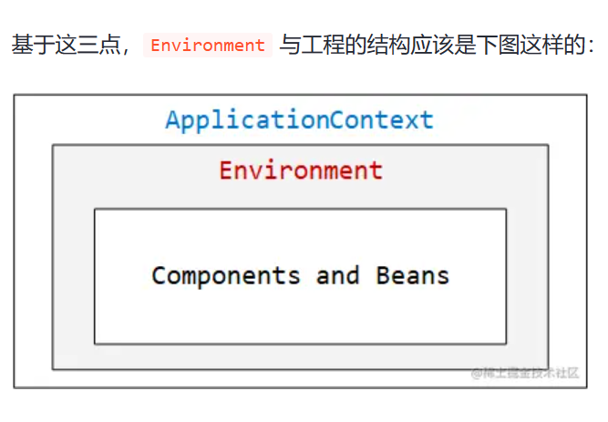

# Spring-framework #
## servlet 与 springframework概述 ##
1. 在Java开发中，WAR(Web Application Archive)包和JAR(Java Archive)包是两种常见的打包方式，它们在用途和结构上有所区别。

|    |                                      WAR包                                       |                              JAR包                              |
|:--:|:-------------------------------------------------------------------------------:|:--------------------------------------------------------------:|
| 用途 |                  WAR包主要用于打包和部署Web应用程序，例如JavaEE应用或基于Servlet的应用                   |         JAR包是一种通用的Java打包格式，主要用于打包和分发Java类库、可执行程序或独立应用          |
| 结构 | WAR包是一种特殊的JAR包，它包含了Web应用程序的相关资源，如HTML、JSP、Servlet、Java类、配置文件、图像、CSS和JavaScript等 |   JAR包包含了Java类文件、资源文件、配置文件和其他依赖项，以及用于描述JAR包内容的清单文件(Manifest)   |
| 部署 |            WAR包可以直接部署到Java Web容器(如Tomcat、Jetty等)中，容器会解压并运行其中的Web应用程序            | JAR包可以在Java虚拟机(JVM)上直接运行，通过指定包含main()方法的类作为入口点，或者作为依赖库供其他程序使用。 |

2. 当将WAR文件部署到Web服务器或应用服务器时，服务器会将WAR文件的内容提取出来，并将其部署在特定的目录或位置，从而使Web应用程序可以访问。\
   exploded 是一个不同的部署方式。当一个Web应用程序被“exploded”时，意味着WAR文件的内容被解压并以展开的形式部署，而无需压缩归档。
3. application context指的是web应用程序在服务器的上的上下文路径
   http://localhost:8080/demo \
   通过在 Servlet 类上使用 @WebServlet 注解，并指定相对于上下文路径的访问路径，可以控制 Servlet 的访问位置。在这个例子中，访问路径 /demoServlet 会被映射到 Servlet 类，从而在 http://localhost:8080/demo/demoservlet 上访问该 Servlet。
4. 三层架构组件和依赖:
   \
   DAO是数据访问对象(Data Access Object): DAO模式的主要目的是提供一个统一的接口，使业务逻辑层与数据访问层解耦。通过使用DAO，业务逻辑层可以通过调用DAO接口的方法(CRUD)来执行对数据源的操作，而无需了解底层数据源的细节
5. reflection:
Java反射（Reflection）是Java编程语言提供的一种能力，用于在运行时检查、获取和操作类、对象、方法和属性的信息。通过反射，可以在编译时期无法确定的情况下，动态地获取类的结构和成员，并对其进行操作和调用。
6. 控制反转(Inversion of Control):
   核心思想是将对象的创建、组装和管理的责任从应用程序代码转移到容器或框架中，以实现松耦合和可扩展的架构

   |                                     Coding                                     |             Features             |
   |:------------------------------------------------------------------------------:|:--------------------------------:|
   |                 ```private DemoDao dao = new DemoDaoImpl();```                 | 在编译期就必须保证 DemoDaoImpl 存在，主动声明实现类 |
   | ```private DemoDao dao = (DemoDao) BeanFactory.getBean(beanName:"demoDao");``` |     将获取对象的方式交给了 BeanFactory      |

   BeanFactory 根据指定的 beanName 去获取和创建对象的过程，就可以称作**依赖查找**(Dependency lookup)\
   ```Person person = (Person) beanFactory.getBean("person");```
7. 为了减少变动成本，可以把全限定类名等信息通过外部配置文件进行引入。
8. Spring Framework:\
   Spring framework是一个开源的，松耦合的，分层的，可配置的一站式企业级java开发框架，核心是IOC&AOP，它可以更容易构建企业级java应用，并可以根据应用开发的组件需要整合对应技术
9. 为什么使用spring framework:\
   **IOC**:组件之间的解耦\
   **AOP**:切面编程可以将业务做统一或特定增强\
   **容器与事件**:管理组件bean，托管bean的周期
10. "容器"通常指的是一种运行时环境，它能够托管、管理和提供访问应用程序组件的机制
11. IoC容器(Inversion of Control Container): \
    用于实现控制反转(Inversion of Control)和依赖注入(Dependency Injection)的机制。它负责实例化、组装和管理应用程序的对象(bean), Spring Framework的ApplicationContext/BeanFactory就是一个IoC容器。

## IOC 依赖查找 && 依赖注入 (类路径下的xml驱动) ##
1. 依赖查找(dependency lookup)与依赖注入(dependency injection)

    |       |         dependency lookup          |    depedency injection |
    |:-----:|:----------------------------------:|:--------------------------------:|
    | 作用目标  |     依赖查找的作用目标可以是方法体内，也可以是方法体外      |依赖注入的作用目标通常是类成员|
    | 实现方式  |         依赖查找通常主动使用上下文搜索         | 依赖注入通常借助一个上下文被动的接收|
2. BeanFactory 可以根据接口类型，找到对应的实现类 getBeans
    一个接口有多个实现:
    多次getBeans
    一次性想得到所有实现类，ApplicationContext - 传入一个接口/抽象类，返回容器中所有的实现类/子类
3. BeanFactory与ApplicationContext\
    BeanFactory提供了一个**抽象的配置和对象(bean)管理机制**，ApplicationContext是BeanFactory的子接口，它简化了与AOP的整合、消息机制、事件机制以及对web环境的扩展\
    ApplicationContext多了以下机制:
    * AOP 的支持(AnnotationAwareAspectJAutoProxyCreator 作用于 Bean 的初始化之后)
    * 配置元信息(BeanDefinition 、Environment 、注解等)
    * 资源管理(Resource 抽象)
    * 事件驱动机制(ApplicationEvent 、ApplicationListener)
    * 消息与国际化(LocaleResolver)
    * Environment 抽象(SpringFramework 3.1 以后)
4. IOC 容器除了可以根据一个父类/接口来找实现类，还可以根据类上标注的注解来查找对应的 Bean\
    eg. 定义一个annotation: @Color 在其他类上
5. 延迟查找:\
    (IOC容器缺乏bean) 获取bean时先不报错 先给一个包装 后续再决定有没有
    ```
    ObjectProvider<Dog> dogProvider = ctx.getBeanProvider(Dog.class);
    Dog dog = dogProvider.getIfAvailable();
    ```
## 注解驱动 IOC 与组件扫描 ##
1. 注解驱动需要的是配置类，只需要在类上标注一个 @Configuration 注解即可\
   @Bean: 向 IOC 容器注册一个类型为 Person ，id 为 person 的 Bean 。方法的返回值代表注册的类型，方法名代表 Bean 的 id
2. 组件注册与组件扫描:
   @Component: 代表该类会被注册到 IOC 容器中作为一个 Bean (如果在Person类上使用了@Component注解，将其标记为一个组件类，那么在IoC容器中会*创建并注册Person类的一个bean* 后续Spring容器会自动将匹配类型的bean实例注入到类的属性中 以实现依赖注入)
3. @ComponentScan(url): 扫描指定路径包及子包下的所有 @Component 组件
4. @Configuration 也标注了 @Component 注解，证明确实它也会被视为 bean ，注册到 IOC 容器
   @Configuration 注解的类被称为配置类 用于声明和定义bean的创建和配置方式
   @ComponentScanConfiguration一定会被扫描进去
   ```
   String[] beanNames = ctx.getBeanDefinitionNames();
   Stream.of(beanNames).forEach(System.out::println);

   [Output]:
   QuickstartConfiguration
   cat
   person
   ```
5. xml驱动与注解驱动
   XML 用的是 ClassPathXmlApplicationContext 来驱动; 注解用 AnnotationConfigApplicationContext 来驱动。\
   XML驱动的IoC容器使用XML配置文件来定义和组织bean的定义和依赖关系; 注解驱动的IoC容器使用注解来定义bean和其依赖关系。您可以使用注解（例如@Component、@Autowired等）直接在类上标记，无需编写额外的XML配置文件。\
   如果需要注册的组件特别多，那编写这些 @Bean 无疑是超多工作量，于是 SpringFramework 中给咱整了几个注解出来，可以帮咱快速注册需要的组件，这些注解被成为模式注解 ( stereotype annotation )

## 依赖注入 ##
### setter 属性注入 ###
1. xml的setter注入:
   ```
   <bean id="person" class="com.bocloud.spring.basic_di.a_quickstart_set.bean.Person">
        <property name="name" value="test-person-byset"/>
        <property name="age" value="18"/>
   </bean>
   ```
   注解方式的setter注入: @Bean  
   ```
   @Bean
   public Person person() {
   Person person = new Person();
   person.setName("test-person-anno-byset");
   person.setAge(18);
   return person;
   }
   ```
   注入时机: 对象创建后
2. 构造器注入:\
   有一些 bean 的属性依赖，需要在调用构造器（构造方法）时就设置好；或者另一种情况，有一些 bean 本身没有*无参构造器*，这个时候就必须使用构造器注入了。\
   创建时机: 对象创建时
   ```
    public Person(String name, Integer age) {
        this.name = name;
        this.age = age;
    }
   ```

   注解式构造器属性输入
   ```
   @Bean
   public Person person() {
       return new Person("test-person-anno-byconstructor", 18);
   }
   ```
3. 注解式属性注入: 处理声明式注册好的组件\
   i. @Component下 @Value
      将Black类扫到IOC容器\
   ```
   @Component
   public class Black {
      @Value("black-value-anno")
      private String name;
      @Value("0")
      private Integer order;
   }
   ```
   ii. 外部配置文件引入@PropertySource
       @Value("${red.name}") - 占位符
   ```
   red.name=red-value-byproperties
   red.order=1
   ```
4. SpEL表达式: 在属性注入时，使用一些特殊的数值\
   i. 属性注入 @Value("#{'bluevalue'}")\
   ii. Bean属性引用 @Value("#{'copy of ' + blue.name}")\
   iii. 方法调用 @@Value("#{blue.name.substring(0, 3)}")

### 自动注入 && 复杂型注入 ###
1. 一个bean要依赖另一个bean  ->   @Autowired
   @Autowired: 在 Bean 中直接在 属性 / setter 方法 上标注解\
   IOC 容器会按照属性对应的类型，从容器中找对应类型的 Bean 赋值到对应的属性上，实现自动注入
2. @Autowired:\
   i. 属性上标注  (属性注入)
   ```
   public class Dog{
       @Autowired
       private Person person;   // Spring容器负责创建Person的实例，并在创建Dog实例后将其自动注入到属性中
   }
   ```
   ii. 构造器注入
   ```
    @Autowired
    public Dog(Person person) {
        this.person = person;   // Dog组件的依赖对象Person通过构造函数注入。Spring容器负责创建Person的实例，并在创建Dog实例时将其注入到构造函数中。
    }
   ```
   iii. setter方法注入
   ```
    @Autowired
    public void setPerson(Person person) {
        this.person = person;
    }
   ```
3. 注入bean不存在: @Autowired(required=false) 返回null
4. 多个相同类型bean注入:\
   i. @Autowired + @Qualifier: 指定注入bean的名称
   ```
   @Autowired
   @Qualifier("administrator")
   private Person person;
   ```
   ii. @Bean + @Primary: 默认bean，一个类型注册的bean只能有一个
   ```
   @Bean
   @Primary
   public Person master() {
      Person master = new Person();
      master.setName("master");
      return master;
    }
   ```
   @Qualifier 不受 @Primary 的干扰
5. @Autowired 注入原理逻辑：\
   检查被@Autowired注解标记的字段、构造函数或方法参数 -> Spring容器会扫描应用程序上下文中的所有bean -> 如果找到了一个直接返回 -> 如果找到多个类型一样的bean ("administrator","master") 把属性名拿过去 如果bean id相同 则抛出 NoUniqueBeanDefinitionException 异常； 否则直接返回
6. 一次返回所有Person
   ```
   @Autowired
   private List<Person> persons;
   ```
7. JSR-250: @Resource 是直接按照属性名 / Bean的名称注入
   ```
   @Component
   public class Bird {

   @Resource(name = "master")    // 注解相当于 @Autowired + @Qualifier("administrator")
   private Person person;
   ```

8. JSR-330: 跟@Autowired一样 都是按照类型注入 使用方式和spring framework一样
   ```
   @Component
   public class Cat {

      @Inject // 等同于@Autowired
      @Named("admin") // 等同于@Qualifier
      private Person master;
   ```
   |                           @Autowired                            |             @Inject              |
   |:---------------------------------------------------------------:|:--------------------------------:|
    |  import org.springframework.beans.factory.annotation.Autowired  |    import javax.inject.Inject    |
   如果万一项目中没有 SpringFramework 了，那么 @Autowired 注解将失效，但 @Inject 属于 JSR 规范，不会因为一个框架失效而失去它的意义


9. 
10. 


### 回调注入 && 延迟注入 ###
1. 实现对应的XXXAware接口，在容器启动时候回调注入
2. 如果当前的 bean 需要依赖它本身的 name ，使用 @Autowired 就不好使了，这个时候就得使用 BeanNameAware 接口来辅助注入当前 bean 的 name
3. 在回调注入中，一个对象将自己的某个方法作为参数传递给另一个对象，后者在需要的时候调用该方法
4. ApplicationContextAware使用
   * 创建bean实现Aware接口: 当这个 AwaredTestBean 被初始化好的时候，就会把 ApplicationContext 传给它，之后它就可以干自己想干的事了
   ```
   public class AwaredTestBean implements ApplicationContextAware {
   private ApplicationContext ctx;
   @Override
   public void setApplicationContext(ApplicationContext ctx) throws BeansException {
        this.ctx = ctx;
   }
   public void printBeanNames() {
        Stream.of(ctx.getBeanDefinitionNames()).forEach(System.out::println);
    }
   }
   ```
   * 创建配置类
   ```
   @Configuration
   public class AwareConfiguration {
    @Bean
    public AwaredTestBean bbb() {
        return new AwaredTestBean();
    }
   }
   ```


### 小结 ###
1. 依赖注入的目的和优点\
   解耦: 依赖注入通过将依赖关系的创建和管理交给容器来实现解耦。传统的直接依赖会导致对象的创建和初始化过程难以统一控制，而依赖注入可以通过容器自动将依赖的对象注入到需要它们的地方，从而避免了直接依赖，降低了组件间的耦合度。\
   依赖对象可配置性: 通过使用xml或注解进行声明，可以指定和调整组件所需注入的对象。这样，可以根据需求方便地替换或调整依赖的具体实现，而不需要大量修改代码。通过面向接口编程和依赖注入的配合，可以实现灵活的组件替换和扩展，使得代码更具可维护性和可扩展性。
2. 控制反转(Inversion of Control)容器负责将依赖对象注入给需要依赖的组件。


## Bean ##
### Bean的常见类型与Bean的作用域 ###
1. SpringFramework 考虑到一些特殊的设计：Bean 的创建需要指定一些策略，或者依赖特殊的场景来分别创建，也或者使用 xml 或者注解声明也比较复杂 ---> FactoryBean \
   FactoryBean 是一个接口 本身就是一个创建对象的工厂 如果bean实现了FactoryBean接口 那它本身就不再是一个单纯的bean 不会在实际的业务逻辑中起作用 而是由创建的对象起作用\
   ToyFactoryBean.java
   ```
   public class ToyFactoryBean implements FactoryBean<Toy> {

    @Override
    public Toy getObject() throws Exception {
        return null;
    }

    @Override
    public Class<Toy> getObjectType() {
        return Toy.class;
    }
   }
   ```
   BeanTypeAnnoApplication.java
   ```
   public class BeanTypeAnnoApplication {

    public static void main(String[] args) throws Exception {
        ApplicationContext ctx = new AnnotationConfigApplicationContext(BeanTypeConfiguration.class);
        Toy toy = ctx.getBean(Toy.class);
        System.out.println(toy);
    }
   }
   ```
   由创建对象起作用 即`Toy toy = ctx.getBean(Toy.class);` 同时在ToyFactoryConfiguration.java中配置的是*ToyFactoryBean*
2. 普通的Bean对象都是单实例的 在IOC 容器初始化时就已经被初始化了\
   ApplicationContext 初始化 Bean 的时机默认是容器加载时就已经创建\
   FactoryBean 本身的加载是伴随 IOC 容器的初始化时机一起的。\
   FactoryBean 生产 bean 的机制是延迟生产(在第一次获取时创建对应的 Bean 并缓存) 同时 FactoryBean 默认生成的 bean 是单实例的 即 toy1 = toy2
3. |                              BeanFactory                              |                   FactoryBean                   |
   |:---------------------------------------------------------------------:|:-----------------------------------------------:|
    | SpringFramework 中实现 IOC 的最底层容器，ApplicationContext 在最底层组合了 BeanFactory |     创建对象的工厂 Bean ，可以使用它来直接创建一些初始化流程比较复杂的对象      |
4. Sigleton (默认情况下) bean的作用是单实例的 ---> 一个IOC容器只有一个\
   Prototype (原型bean) 每次对原型 Bean 提出请求时，都会创建一个新的 Bean 实例\
   eg. 如果连续 getBean() 两次，那就应该创建两个不同的 Bean 实例；向两个不同的 Bean 中注入两次，也应该注入两个不同的 Bean 实例

### Bean的周期 ###
1. 回调机制: 回调机制的本质是将控制权交给框架或应用程序，在特定的时机或事件发生时，由框架自动调用预定义的接口或方法。回调机制跟 Aware 接口的回调注入，在核心思想上其实是一样的
2. 在 IOC 容器初始化之前，默认情况下 Bean 已经创建好了，而且完成了初始化动作；容器调用销毁动作时，先销毁所有 Bean ，最后 IOC 容器全部销毁完成
   ```
   准备初始化IOC容器。。。
   mimi被初始化了。。。
   IOC容器初始化完成。。。

   准备销毁IOC容器。。。
   mimi被销毁了。。。
   IOC容器销毁完成。。。
   ```
3. Bean的周期: 对属性赋值 ---> 执行 init-method 标记的方法 (setName)
   ```
   准备初始化IOC容器。。。
   Cat 构造方法执行了。。。
   setName方法执行了。。。
   mimi被初始化了。。。
   IOC容器初始化完成。。。

   ```
4. 手动声明注册的Bean:
   ```
   @Configuration
   public class InitConfiguration {
       @Bean(initMethod = "init", destroyMethod = "destroy")
       public Dog dog(){
       Dog dog = new Dog();
       dog.setName("wangwang");
       return dog;
      }
    }
   ```
5. 使用模式注解的 Bean ---> 没有可以声明 init-method 和 destroy-method 的地方 且 @Component 注解上也只有 value 属性 ---> JSR250 @PostConstruct (init-method) @PreDestroy (destroy-method)
6. 单实例bean:
   ```
   准备初始化IOC容器。。。
   @PostConstruct - 钢笔中已加满墨水。。。
   InitializingBean - 准备写字。。。
   init-method - 打开钢笔。。。
   IOC容器初始化完成。。。

   准备销毁IOC容器。。。
   @PreDestroy - 钢笔中的墨水都放干净了。。。
   DisposableBean - 写完字了。。。
   destroy-method - 合上钢笔。。。
   IOC容器销毁完成。。。
   ```
   原型bean:
   ```
   准备获取一个pen
   @PostConstruct - 钢笔中已加满墨水。。。
   InitializingBean - 准备写字。。。
   init-method - 打开钢笔。。。
   已经获取到一个pen
   pen finished, ready for destroy
   @PreDestroy - 钢笔中的墨水都放干净了。。。
   DisposableBean - 写完字了。。。
   destroy finished
   ```
7. |              | @PostConstruct & @PreDestroy | InitializingBean & DisposableBean | init-method & destroy-method |
   |:------------:|:----------------------------:|:---------------------------------:|:----------------------------:|
    |执行顺序|first|second|third|
    |组件耦合度|与JSR规范耦合|与SpringFramework耦合|无侵入 (只在 @Bean 使用)|
     |单实例bean|√|√|√|
     |原型bean|√|√|只支持init-method|


## 事件机制 && 监听器 ##
1. 事件驱动核心:\
   事件源\
   事件: RegisterSuccessEvent extends ApplicationEvent\
   广播器: \
   RegisterService implements ApplicationEventPublisherAware\
   用ApplicationEventPublisher发布事件
   监听器:\
   i. MessageSenderListener{
      @EventListener
      Method()
      }\
   ii. SmsSenderListener implements ApplicationListener<RegisterSuccessEvent>
2. SpringFramework 内置事件\
   i. ApplicationEvent\
   ii. ApplicationContextEvent\
   ```
   public ApplicationContextEvent(ApplicationContext source) {
   super(source);
   }
   ```
   事件发生时，可以通过监听器直接取到 ApplicationContext
3. ContextRefreshedEvent: IOC 容器刷新完毕但尚未启动\
   ContextClosedEvent: IOC 容器已经关闭但尚未销毁所有 Bean
4. ApplicationListener 会在容器初始化阶段就准备好，在容器销毁时一起销毁
5. ApplicationListener 也是 IOC 容器中的普通 Bean
6. 回调注入的常见用例是在事件驱动的编程模型中，其中对象可以注册为事件监听器，并在特定事件发生时回调其相应方法。回调注入可以将事件处理的责任从调用方转移到被注入对象，使得代码更加模块化和可扩展。


## 模块装配 ##
1. 模块装配是指将不同的模块或组件组合在一起，形成一个完整的系统或应用程序的过程\
   模块装配原则: 自定义注解 + @Import 导入组件
2. 装配方式
   ```
   @Documented
   @Retention(RetentionPolicy.RUNTIME)
   @Target(ElementType.TYPE)
   public @interface EnableTavern {
   }
   ```
   ```
   @Import({Boss.class, BartenderConfiguration.class, BarImportSelector.class, WaiterRegistrar.class})  // 如果标注了 @EnableTavern 注解，就会触发 @Import 的效果，向容器中导入一个 Boss 类型的 Bean
   ```
   i. 导入普通类\
   `public class Boss{}`\
   ii. 导入配置类\
   注册多个相同类型的 Bean\
   ```
   @Configuration
   public class BartenderConfiguration {
    @Bean
    public Bartender zhangxiaosan() {
        return new Bartender("张小三");
    }
    @Bean
    public Bartender zhangdasan() {
        return new Bartender("张大三");
    }
   }
   ```

   iii. 导入ImportSelector (普通类 / 配置类)
   ```
   public class BarImportSelector implements ImportSelector {
    public String[] selectImports(AnnotationMetadata importingClassMetadata) {
        return new String[] {Bar.class.getName(), BarConfiguration.class.getName()};
    }
   }
   ```
   iv. 导入ImportBeanDefinitionRegistrar

## 条件装配 ##
1. 条件装配是指根据特定条件来选择性地装配和配置组件或模块的过程。它允许在不同的环境或情况下，根据条件的不同，动态地决定应该使用哪种配置或装配方式。
2. @Profile\
   注解可以标注在组件上，当一个配置属性（并不是文件）激活时，它才会起作用，而激活这个属性的方式有很多种（启动参数、环境变量、web.xml 配置等）
   ```
   @Configuration
   public class BartenderConfiguration {
      //....
      @Bean
      @Profile("city")
   }
   ```
3. @Profile 控制的是整个项目的运行环境 无法根据单个bean的因素决定是否装配 ---> @Conditional
4. @Conditional
   @Conditional 注解可以指定匹配条件，而被 @Conditional 注解标注的 组件类 / 配置类 / 组件工厂方法 必须满足 @Conditional 中指定的所有条件，才会被创建 / 解析
   ```
   // Bar的创建要基于Boss
   @Bean
   @Conditional(ExistBossCondition.class)  // ---> 判断IOC容器是否存在Boss类对象
   public Bar bbbar() {
      return new Bar();
   }
   ```
5. 通用抽取 ---> 减少写Condition数量 把匹配规则抽取为通用方式
   ```
   @Documented
   @Retention(RetentionPolicy.RUNTIME)
   @Target({ElementType.TYPE, ElementType.METHOD})
   @Conditional(OnBeanCondition.class)
   public @interface ConditionalOnBean {
      String[] beanNames() default {};
   }
   ```
   ```
   public class OnBeanCondition implements Condition {
   ```

## 资源管理 ##

1. 资源加载方式:\
   i. ClassLoader → ClassPathResource [ classpath:/ ]\
   ii. File → FileSystemResource [ file:/ ]\
   iii. URL → UrlResource [ xxx:/ ]\


## PropertySource的使用 ##

## 配置源 & 配置元信息 ##
1. 配置源: 配置的来源   ---> xml配置文件/注解驱动类配置IOC容器
2. Spring拿到配置源后: 加载 -> 解析 -> 注册
3. Bean 的定义元信息:
   SpringFramework 中定义的 Bean 也会封装为一个个的 Bean 的元信息，也就是 BeanDefinition
   Bean 的全限定名 className
   Bean 的作用域 scope
   Bean 是否延迟加载 lazy
   Bean 的工厂 Bean 名称 factoryBean
   Bean 的构造方法参数列表 constructorArgumentValues
   Bean 的属性值 propertyValues
4. IOC 的配置元信息: beans + context
5. properties等配置元信息: **做外部化配置，提供属性配置，给组件注入属性值**
   properties/xml/yml 文件，它们的作用都是为了将具体的配置抽取为一个可任意修改的配置文件，防止在程序代码中出现硬编码配置，导致修改配置还需要重新编译的麻烦
   @PropertySource


## Environment ##
1. *Environment 是抽象的概念，包含了profile和properties的信息，可以实现统一的配置存储和注入，配置属性的解析等，其中profile实现了一种基于模式的环境配置，properties则用于外部化配置*
2. 
3. Environment 接口的实例通常由 ApplicationContext 负责创建，并在应用程序中传递。Spring的配置源（例如 XML 配置文件、Java 配置类等）可以通过属性占位符（${...}）或 @Value 注解来引用环境变量或配置属性
4. 虽然 Environment 和 ApplicationContext 都可以获取应用程序的配置信息，但它们的关系是 ApplicationContext 包含了 Environment。也就是说，ApplicationContext 是一个更高级的容器，除了包含 Environment 的功能，还扩展了很多其他的功能，使得它成为一个全面的 Spring 应用程序上下文。
5. Environment 接口的常用功能如下：
   * 通过 getProperty(String key) 方法获取应用程序的配置属性值。配置属性可以通过 Spring 配置文件或 Java 配置类中的属性占位符（${...}）定义。
   * 通过 getProperty(String key, String defaultValue) 方法获取应用程序的配置属性值，如果属性不存在则返回指定的默认值。
   * 获取默认的配置概要：通过 getDefaultProfiles() 方法获取默认的配置概要，用于表示默认的配置环境。


## Bean 与 BeanDefinition ##
1. BeanDefinition 描述了Springframework中bean的元信息，它包含了bean的类信息 属性 行为 依赖关系 配置关系等。BeanDefinition具有层次性，并且可以在IOC容器初始化阶段BeanDefinitionRegistryPostProcessor构造和注册 被BeanFactoryPostProcessor拦截修改等
2.
